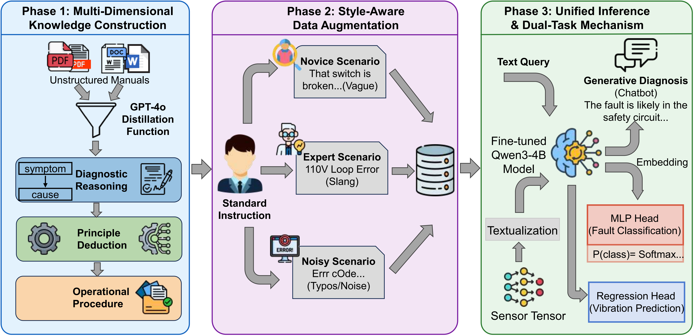

# SA-CoT: Elevator Predictive Maintenance & LLM Optimization

**SA-CoT** (Sensor Analytics & Chain-of-Thought) is a comprehensive framework for elevator predictive maintenance. This project combines traditional machine learning with Large Language Models (LLMs) to provide fault diagnosis, vibration regression, and intelligent maintenance assistance.



## 🚀 Part 1: Generative Model Training (SA-CoT)

This section covers the generation of the Style-Aware Chain-of-Thought dataset and the Supervised Fine-Tuning (SFT) of the Qwen3-4B backbone.

### Step 1: Generate SA-CoT Data

Generate the stylized CoT instruction dataset (Standard, Novice, Expert, Noisy) from unstructured technical manuals.

```
python3 generate_cot.py
```

### Step 2: LoRA Fine-Tuning

We utilize the LLaMA-Factory framework for Parameter-Efficient Fine-Tuning (PEFT). 

```
llamafactory-cli train config/qwen3_lora_sft.yaml
```

**Important:** Please modify `qwen3_lora_sft.yaml` to update the `dataset_dir` and adjust hyperparameters (e.g., batch size, learning rate) according to your custom dataset and GPU memory capacity.

### Step 3: Model Inference & Testing

Evaluate the generative diagnostic capabilities (e.g., BLEU, ROUGE, BERTScore) of the fine-tuned model on the test set.

```
python3 test_xxx.py
```

## 📊 Part 2: Downstream Numerical Tasks

To bridge the semantic-physical gap, we textualize raw continuous sensor telemetry (e.g., speed, vibration, temperature) and pass it through the frozen, fine-tuned SLM to extract high-dimensional latent embeddings ($h_{last}$). These embeddings are then used to train lightweight heads for numerical prediction.

### Train Fault Classification (Discriminative Task)

Train a Multi-Layer Perceptron (MLP) head on the extracted SLM embeddings to classify elevator alarm types (e.g., Leveling Failure, Over-travel).

```
python3 cla.py
```

### Train Vibration Magnitude Prediction (Regression Task)

Train a regression head on the embeddings to predict continuous vibration magnitude, serving as a proxy for mechanical wear.

```
python3 reg.py
```